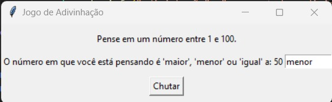
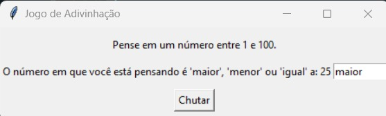
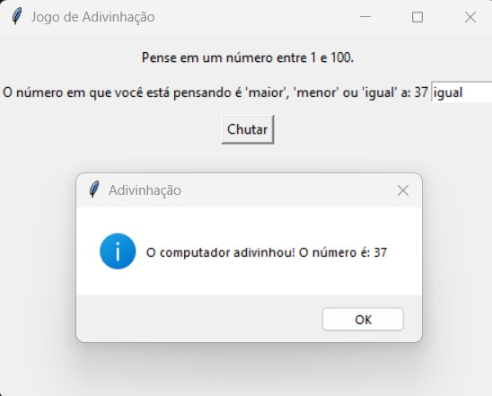

# Guess What

**Número da Lista**: 10 Divisão e ConquistaGrafos2 

## Alunos
|Matrícula | Aluno |
| -- | -- |
| 20/0043536  |  Silas Neres de Souza|
| 20/2017521  |  Algusto Rodrigues Caldas |

## Sobre 
xxxx

## Screenshots

xxx

xxx

xxx

## Instalação 
**Linguagem**: Python 
**Framework**: Pygame e Numpy 
Necessário ter uma versão atualizada da linguagem Python (Preferência 3.10) e, além disso, instalar o framework xxx e xxx (Use o comando: pip install). 

## Uso 
xxxx

## Outros 
xxxx
